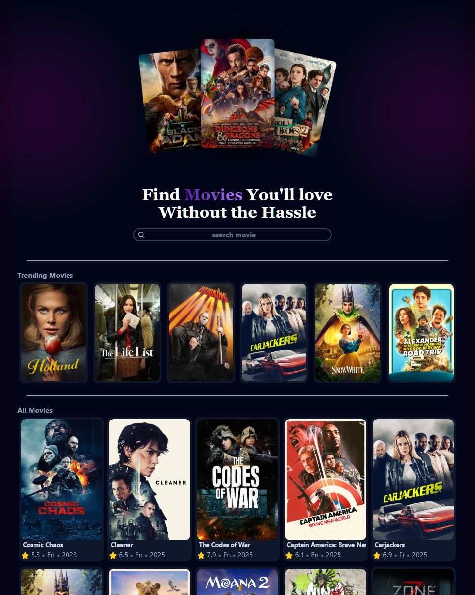

# About : Mubi App

For learning react  + tailwind, i created this mubi database webstie using api from TMDB service

It is created using React + Vite and uses following online services

1. heroicons: I used search icon  
2. heropattern: I used it for the nice purplish dark background 😄
3. flowbite: I didn't use it, but mentioned it for future use
4. appwrite.io: for database. Every search made is stored in database to create Trending list of movies by search count
5. tmdb api : This is the source of movie database

# How to run
    
    npm run dev

